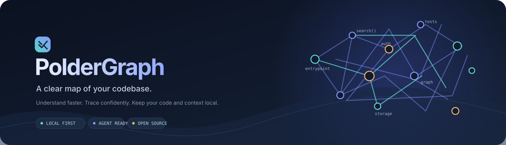
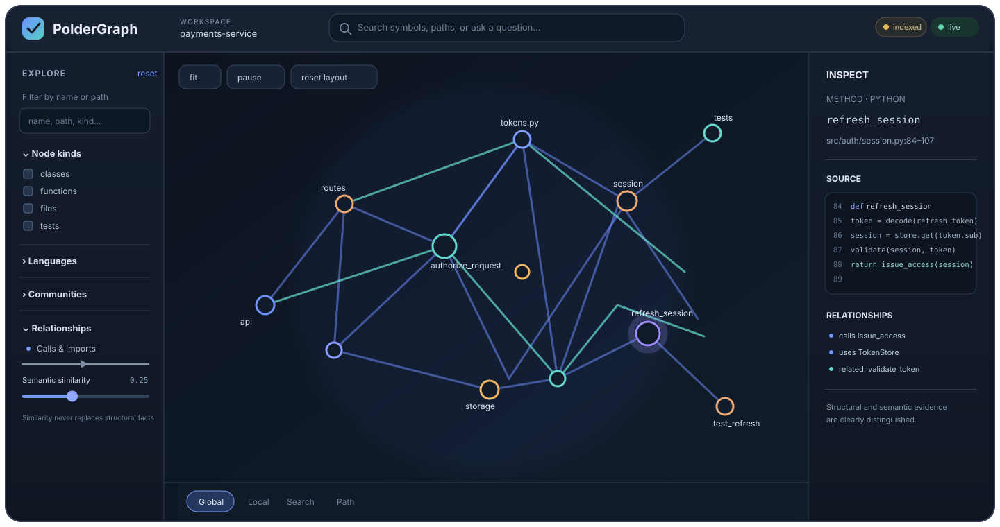

# PolderGraph

<p align="center">
  
</p>

<p align="center">
  <a href="https://github.com/PolderLabs/PolderGraph/releases/latest"></a>
  <a href="https://github.com/PolderLabs/PolderGraph/blob/main/LICENSE"></a>
  
  
</p>

**Give yourself and your coding agent a useful map of a repository.** PolderGraph connects code structure, meaning, and tests so you can find where a behavior lives, trace what it depends on, and get grounded context for the next change.

Start with one command. Explore the graph in your browser, or connect your coding agent through MCP. Your source and index stay on your machine; semantic search runs locally.

## Install

> **⚠️ Disk space:** PolderGraph downloads a ~2 GB embedding model (EmbeddingGemma 2) the first time you run `poldergraph init`. Python dependencies (PyTorch, transformers, tree-sitter) add another ~1.5 GB. Expect **3–4 GB of free disk space** before installing. The model and dependencies are cached locally and reused across all repositories.

Requirements: Python 3.11 or newer, `curl`, and internet access for installing dependencies and downloading the embedding model the first time you index a repository. No API key or cloud service is required.

### Linux and macOS

```bash
curl -fsSL https://raw.githubusercontent.com/PolderLabs/PolderGraph/main/scripts/install.sh | sh
```

### Windows (PowerShell)

```powershell
irm https://raw.githubusercontent.com/PolderLabs/PolderGraph/main/scripts/install.ps1 | iex
```

The installer sets up `uv` if needed and installs the latest GitHub release. Then, from the repository you want to explore:

```bash
poldergraph init
poldergraph ui
```

`init` indexes the project and prepares local search. `ui` opens the interactive graph. To connect an agent, run `poldergraph setup-agent` or configure `poldergraph mcp` in your MCP client.

<p align="center">
  
</p>

## Why PolderGraph?

- **Find code by intent.** Ask questions like “where is authorization checked?” and search by meaning, names, and file contents.
- **Follow real relationships.** Trace calls, imports, inheritance, and tests back to their source locations.
- **Understand impact before changing code.** Explore callers, dependencies, and related tests.
- **Keep context local.** Source, embeddings, and the index stay on your machine. No hosted database, remote inference, or telemetry by default.
- **Use the tools you already have.** Work in the dashboard, use the CLI, or let an MCP-capable agent query the same index.

PolderGraph keeps parsed structural facts separate from semantic similarity, so “these concepts are related” is never presented as “this function calls that function.”

## What it does

PolderGraph answers repository questions by combining independent evidence channels:

- **Exact lookup**: identifiers, qualified names, paths
- **Lexical search**: BM25-ranked full-text search over names, signatures, docs and paths
- **Semantic search**: EmbeddingGemma 2 vector similarity
- **Structural graph**: calls, imports, inheritance, containment, references

No single channel is authoritative for every task. Hybrid retrieval fuses all channels with inspectable score features so you can see why an item ranked where it did.

## Command surface

```bash
# Index and update
poldergraph init                          # Full index with embedding model download
poldergraph update                        # Incremental update (only changed files)
poldergraph watch                         # Continuous incremental updates

# Search and inspect
poldergraph search "where is authorization enforced?"
poldergraph search "session" --explain-score --kind method
poldergraph explain AuthService
poldergraph path AuthController UserRepository
poldergraph related AuthService
poldergraph impact Session --max-depth 3
poldergraph context "how does login work?" --json --budget 4000

# Dashboard and MCP
poldergraph ui                            # Interactive graph dashboard
poldergraph mcp                           # MCP server for coding agents
poldergraph setup                         # Interactive agent integration setup
poldergraph setup-agent                   # Generate AGENTS.md + MCP config

# Diagnostics
poldergraph status                        # Index health, model, language support
poldergraph doctor                        # Integrity checks
poldergraph rebuild                       # Atomic safe rebuild
poldergraph config show --effective       # Merged configuration

# Fast repeat queries (optional)
poldergraph daemon start                  # Keep the embedding model warm
poldergraph daemon status
poldergraph daemon stop
```

Every command supports `--json` with a stable, versioned envelope. Exit codes are documented for agent scripting.

## Fast repeat queries

Every command that needs semantic search builds the embedding backend, and on a
warm model cache that costs about 6 seconds. An agent running a dozen queries
pays that a dozen times.

`poldergraph daemon start` keeps one process resident with the model, vector
store and SQLite connection already loaded, so repeat queries answer in well
under a second. The daemon starts automatically on first use, keeps one socket
per workspace, and the client falls back to in-process execution whenever the
daemon is unavailable — results are identical either way.

```bash
poldergraph daemon start           # ~10s once
poldergraph search "..."           # sub-second from then on
poldergraph daemon stop
```

Memory commands are served by the same resident process, so
`poldergraph memory search` does not rebuild the embedding model per recall.

The daemon re-reads the index on every request, so `poldergraph update` is
visible immediately; cached community data invalidates when the graph changes.
After 15 minutes without a client connection, it shuts down and releases its
workspace watcher; the next request starts it again. Set
`POLDERGRAPH_DAEMON_IDLE_SECONDS` to change the idle period (use `0` to keep it
resident until explicitly stopped), or set `POLDERGRAPH_NO_DAEMON=1` to bypass
the daemon.

## Architecture

```
Repository
    │
    ├── Discovery (gitignore, .ignore, .poldergraphignore, symlink safety)
    │
    ├── Parsing (tree-sitter, 13 strong adapters, cross-file resolver)
    │
    ├── Embedding (EmbeddingGemma 2, Ollama, lazy multimodal encoders)
    │
    ├── Indexing (incremental, content/semantic hashing, watch mode)
    │
    └── Graph (Leiden communities, metrics, semantic edge policy)
            │
            ├── SQLite + FTS5 + sqlite-vec (single .poldergraph/index.sqlite3)
            │
            ├── Hybrid retrieval (fusion, rerank, context packing)
            │
            └── CLI · MCP · FastAPI API · React/Sigma.js Dashboard
```

## Supported languages

**Strong adapters** (full semantic extraction: imports, calls, inheritance, type references):

Python · TypeScript · TSX · JavaScript · JSX · Rust · Go · Java · C · C++ · C# · Kotlin · Swift

**Baseline indexing** (file + definition symbols from tree-sitter grammars):

Ruby · PHP · Scala · Perl · Lua · Haskell · Elixir · Erlang · OCaml · Zig · Dart · Groovy · Objective-C · R · Julia · Shell · SQL · Vue · Svelte

**Documentation**: Markdown (heading-ancestry sections) · PDF (per-page text extraction)

**Media**: Images (dimensions) · Audio (segmented, ffprobe) · Video (temporal sampling)

## Agent integration

After `poldergraph init`, coding agents discover PolderGraph through generated `AGENTS.md` instructions:

```markdown
<!-- poldergraph:start -->
## PolderGraph repository intelligence

When a task depends on understanding repository structure, finding implementations,
tracing dependencies, locating tests, or estimating change impact:

1. Prefer the PolderGraph MCP tools when available.
2. Start with `pg_context`, which includes relevant project memories and user
   preferences, or run: `poldergraph context "<your task or question>" --json`
3. If the result says the index is stale, run: `poldergraph update --quiet`
4. Use `poldergraph path "<A>" "<B>" --json` for relationship/path questions.
5. Use `poldergraph explain "<symbol>" --json` for a focused symbol.
6. Use `poldergraph impact "<symbol-or-path>" --json` before broad refactors.
7. Save lasting preferences and durable project decisions with `pg_memory_add`;
   never save credentials or transient task details.
<!-- poldergraph:end -->
```

### MCP tools

| Tool | Description |
|------|-------------|
| `pg_status` | Index existence, freshness, model, counts |
| `pg_search` | Hybrid search with score decomposition |
| `pg_context` | Agent-optimized context pack under a token budget |
| `pg_entity` | Entity details and bounded neighborhood |
| `pg_path` | Relationship path between two entities |
| `pg_related` | Semantic neighbours with structural linkage |
| `pg_impact` | Reverse dependency / change impact analysis |
| `pg_update` | Incremental index refresh |
| `pg_find_tests` | Structurally or lexically linked tests |
| `pg_memory_search` | Vector and keyword recall across user preferences and project notes |
| `pg_memory_add` | Save durable user or project memories to the local central store |
| `pg_memory_update` / `pg_memory_forget` | Maintain and remove saved memories |

## Shared agent memory

PolderGraph keeps one private memory database for your user account and separates memories by scope:

- **User memories** carry across every project, such as writing preferences and recurring workflow choices.
- **Project memories** stay available only when an agent is working in that repository, such as architecture decisions and local conventions.

OMP and Codex retrieve relevant memories automatically when they build task context. When the Codex lifecycle hook is explicitly installed, its trusted user-input event can save only explicit, durable first-person preferences; repository context and agent-authored tool arguments never trigger preference capture. Durable project decisions are saved by the agent when established. No separate memory service or repository file is needed. Memory search combines local EmbeddingGemma vectors with keyword matching, rejects weak matches, and avoids model inference when exact keyword evidence is already strong. The same bounded results are available through the CLI and MCP.

```bash
# Save a preference for all projects
poldergraph memory add "Keep explanations concise and include a short example" \
  --scope user --kind preference --tag communication

# Save a decision only for the current project
poldergraph memory add "API handlers use the shared auth dependency" \
  --scope project --kind decision --tag architecture

# Recall relevant memories, inspect the store, or remove an entry by ID
poldergraph memory search "auth handler conventions" --json
poldergraph memory status
poldergraph memory forget mem_...
```

The database lives under your OS user-data directory (`%LOCALAPPDATA%` on Windows, `~/Library/Application Support` on macOS, or `$XDG_DATA_HOME`/`~/.local/share` on Linux). Set `POLDERGRAPH_MEMORY_DB` to move it. Project source and memories stay local; memory records are never written into Git. Do not save passwords, API keys, private keys, or one-off task details. See [the memory guide](docs/memory.md) for retrieval, controls, and privacy details.

### Memory retrieval benchmark

We benchmarked local retrieval against a standard coding-agent baseline with no persistent memory. On a fixed synthetic set of 20 coding-memory questions and 8 unrelated abstention questions, EmbeddingGemma 2 on CPU achieved **100% Hit@5**, **0.910 MRR**, and **100% abstention** on unrelated questions. The no-memory baseline achieved **0% Hit@5** because it had no cross-session evidence. PolderGraph returned an average of **40 estimated memory tokens per positive query**; warm lookup averaged **190 ms** (p95 **251 ms**) after the model was loaded. First-query model initialization took **23.6 s** on this CPU environment.

This measures retrieval only, not end-to-end coding-task completion or developer productivity. The benchmark and dataset are reproducible with:

```bash
uv run --extra semantic --extra vectors python scripts/benchmark_memory.py --device auto
```

The test follows the separation of accurate retrieval and abstention emphasized by [LongMemEval](https://arxiv.org/abs/2410.10813) and [MemoryAgentBench](https://arxiv.org/abs/2507.05257). These results are local to the recorded dataset, model, and CPU; rerun on the target machine before comparing performance.

### Context planner benchmark

On the same synthetic repository corpus, we compared task-adaptive context with a fixed 3,000-token context budget. The offline run used 8 repository questions plus greeting and unrelated prompts, repeated 30 times each, with semantic embeddings disabled. The planner matched the baseline's **87.5% expected-entity case recall** while using **520 vs 1,026 estimated content tokens per request** (49% fewer). Expected-entity precision was **23.7% vs 10.4%**, and the planner skipped retrieval on the two unrelated prompts. Mean latency was **4.0 ms vs 3.1 ms**; p95 was **7.2 ms vs 5.5 ms**. The extra planning/packing work adds a few milliseconds in this small local run, while reducing context and irrelevant evidence.

This is an evidence-coverage proxy, not model-judged grounding or task success. It uses a synthetic corpus, lexical/structural retrieval, and one machine; it does not establish that an agent solves coding tasks better. Reproduce it with:

```bash
uv run python tests/benchmarks/benchmark_context_planner.py --repeats 30
```

See [benchmark methodology](docs/benchmark-methodology.md#context-planner-benchmark) for metric definitions and limitations.

## Typed decisions API

PolderGraph includes a provider-neutral typed decisions engine for asking structured questions about code and state. It supports three backends:

- **Jev** (hosted TypeSafe) — `provider="typesafe"`, requires `TYPESAFE_API_KEY`
- **OpenAI Decisions** — `provider="openai"`, requires `OPENAI_API_KEY`
- **Laya** (local model) — `provider="laya"`, runs entirely offline

Nothing is called by default. The engine is integrated into:

- **Search routing**: ambiguous natural-language queries get a typed decision to select semantic vs structural retrieval path
- **Memory relevance**: weak candidate memories are filtered before entering agent context
- **Automatic preference capture**: the opt-in Codex user-input hook applies deterministic, secret-filtered rules to explicit first-person statements

```python
from poldergraph.decisions import choice, decide, predicate, score

result = decide(
    {"request": "Remember that this repo uses pnpm, not npm.", "source": "explicit user statement"},
    {
        "action": choice("action", "Should this become a durable memory?",
                         {"store": "explicit and durable", "reject": "temporary or ambiguous"}),
        "explicit": predicate("explicit", "The user directly stated this."),
    },
    provider="laya",
)
print(result["answers"]["action"]["choice"])
```

Decisions are cached for 5 minutes by content hash. Raw prompts are never retained. Hosted providers receive only the short query or candidate excerpts needed for each decision. Enable in config:

```toml
[decisions]
provider = "laya"  # typesafe, openai, laya, or disabled
confidence_threshold = 0.9
timeout = 3.0
```

See [docs/decisions.md](docs/decisions.md) for API details and privacy model.

## Codex setup

Install PolderGraph, initialize the repository, then enable Codex integration:

```bash
uv tool install "poldergraph[all] @ git+https://github.com/PolderLabs/PolderGraph.git"
poldergraph init
poldergraph setup --agent codex
```

This adds a repository skill under `.agents/skills/poldergraph/`, PolderGraph
guidance in `AGENTS.md`, and a project-scoped MCP server in
`.codex/config.toml`. Trust the repository in Codex and restart or reload the
Codex session so the skill and MCP tools become available. Initialize or update
the index with `poldergraph init` when needed. See [docs/agents.md](docs/agents.md)
for details. Run `poldergraph setup` without options to interactively choose
integrations for agents detected on your machine.

## Oh My Pi extension

PolderGraph ships with an installable OMP extension. Install it once; it
automatically installs the local CLI, indexes each repository in the
background, refreshes after edits, and adds task-specific graph context to
agent prompts:

```bash
omp install github:PolderLabs/PolderGraph
```

The first setup needs `uv`, network access for package/model downloads, and
several gigabytes of disk space. Open the graph with `/poldergraph ui`; basic
configuration is available through `/poldergraph config`. See
[docs/omp.md](docs/omp.md) for details.

## Dashboard

The interactive graph dashboard uses Sigma 4 alpha (WebGL), Graphology, and ForceAtlas2 in a web worker. Run `poldergraph ui` to open it at `http://127.0.0.1:7432`.

Features:
- Global graph with community aggregation
- Local graph (N-hop neighborhood with depth/direction controls)
- Search with evidence badges (exact, lexical, semantic, graph-expanded)
- Path visualization
- Inspector with structural + semantic relations
- Filters: kind, language, community, edge type, provenance, semantic similarity
- Community collapse with structural/hybrid labeling
- Node pinning, dragging, back/forward selection history
- Live updates via SSE when `poldergraph watch` is active
- Dark mode, persisted view preferences

## Configuration

```toml
# .poldergraph/config.toml
version = 1

[index]
dimensions = 256
include_media = true

[embedding]
backend = "native"          # native, ollama, or none
model = "google/embeddinggemma-2"
device = "auto"             # auto, cpu, cuda, mps

[semantic_edges]
enabled = true
top_k = 12
mutual_preferred = true
max_degree = 8

[graph]
community_algorithm = "leiden"

[retrieval]
default_context_tokens = 6000

[ui]
host = "127.0.0.1"
port = 7432

[privacy]
allow_model_downloads = true
allow_remote_embedding = false
telemetry = false
```

Override with environment variables: `POLDERGRAPH_EMBEDDING__DEVICE=cuda`

## Design principles

**Structural truth and semantic evidence are different.** A parsed call edge is a fact. A cosine similarity is evidence. They never share a type, and a semantic edge is never promoted to a structural one.

**Index entities, not arbitrary chunks.** The primary retrieval unit is a semantic entity: function, class, module, section, etc.

**Local-first means local-first.** All indexed content, embeddings, metadata and search history stay on the user's machine. No telemetry, no remote inference by default.

**Agent-first, not agent-only.** Human UX and agent UX use the same graph/index. The dashboard is for exploration; MCP and CLI are for machine interaction.

**One index, many consumers.** CLI, dashboard, MCP, and IDE integrations all query the same `.poldergraph/` index.

## Documentation

- [docs/architecture.md](docs/architecture.md) — processes, components, boundaries
- [docs/data-model.md](docs/data-model.md) — canonical entities, edges, persistence
- [docs/indexing.md](docs/indexing.md) — discovery, parsing, embeddings, incremental updates
- [docs/retrieval.md](docs/retrieval.md) — semantic/lexical/graph retrieval, ranking, context packing
- [docs/dashboard.md](docs/dashboard.md) — interactive graph explorer
- [docs/agents.md](docs/agents.md) — MCP, CLI, AGENTS.md generation
- [docs/codex.md](docs/codex.md) — automatic Codex prompt context
- [docs/omp.md](docs/omp.md) — Oh My Pi plugin setup and behavior
- [docs/cli-reference.md](docs/cli-reference.md) — CLI command reference
- [docs/mcp-reference.md](docs/mcp-reference.md) — MCP tool reference
- [docs/configuration.md](docs/configuration.md) — configuration reference
- [docs/dashboard-controls.md](docs/dashboard-controls.md) — dashboard UI controls
- [docs/privacy-security.md](docs/privacy-security.md) — privacy and security model
- [docs/troubleshooting.md](docs/troubleshooting.md) — common issues and fixes
- [docs/benchmark-methodology.md](docs/benchmark-methodology.md) — benchmark methodology and results
- [docs/implementation-checklist.md](docs/implementation-checklist.md) — acceptance criteria

## Requirements

- Python 3.11+
- tree-sitter-language-pack (bundled in the `semantic` extra)
- sqlite-vec (bundled in the `vectors` extra)
- ~2GB disk for the EmbeddingGemma 2 model on first use

## License

Apache-2.0
